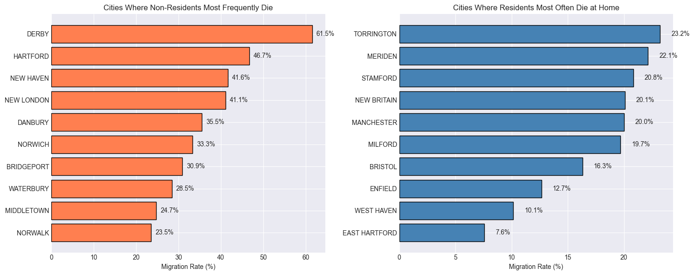
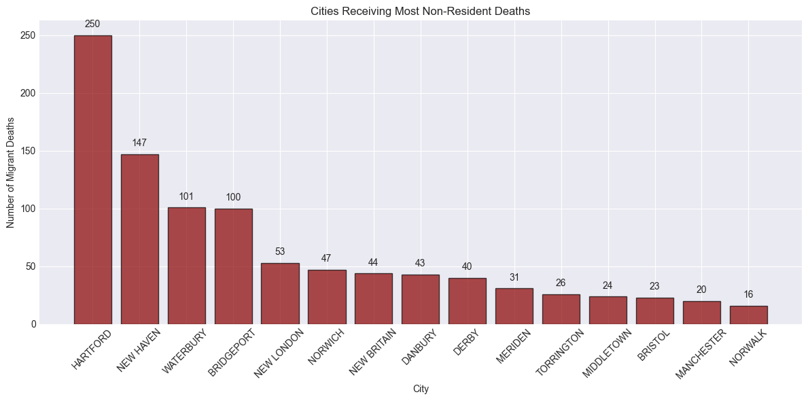
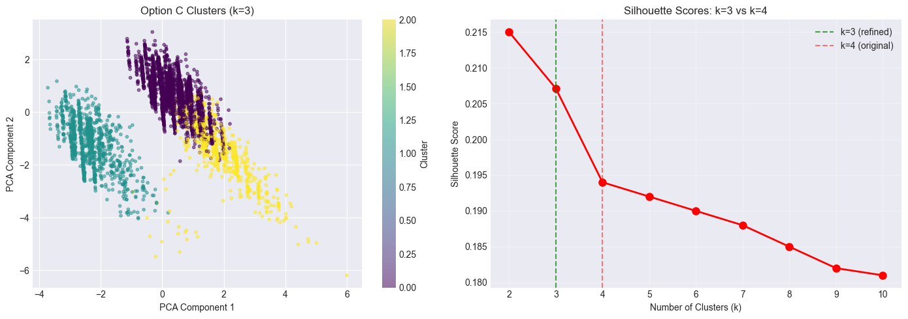
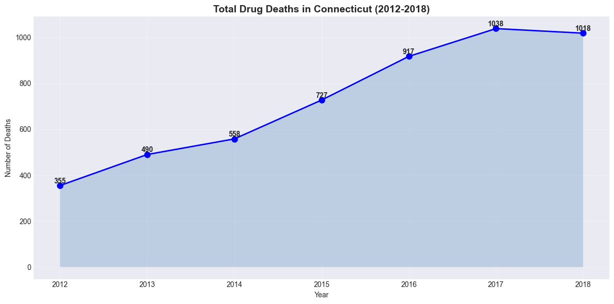
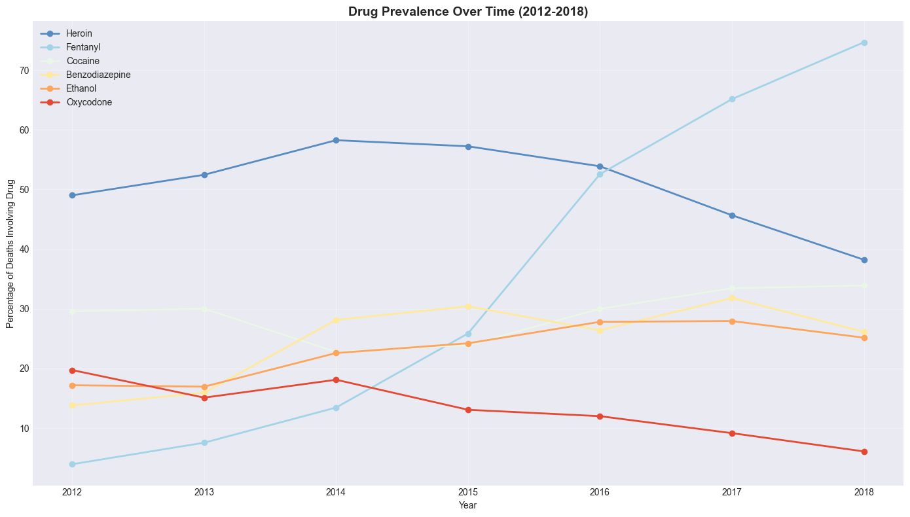
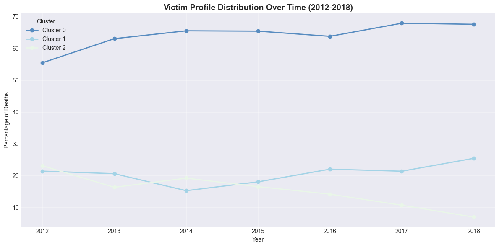

# Connecticut Drug Deaths Analysis (2012-2018)

**A complete data science project: from raw data to clustering to time series forecasting**

## Project Overview.

This project analysed a Connecticut drug overdose deaths dataset collected between 2012 and 2018. Through the use of Python and scikit-learn, the analysis moved from cleaning the raw data, identifying victim profiles through clustering and tracking the evolution of drug usage patterns.

**Key question:** How did the drug supply and victim demographics change as Connecticut's overdose crisis tripled in size?

**Answer:** The crisis took on a new shape, from prescription opioids and heroin to a fentanyl-dominated landscape where polydrug use became the norm.

## Dataset

- **Source:** Connecticut Accidental Drug Related Deaths (2012-2018)
- **Records:** 5,105 deaths
- **Time period:** 2012-2018
- **Key columns:** Age, Sex, Race, Death location, 15 drug presence indicators (Heroin, Fentanyl, Cocaine, Oxycodone, etc.)

**Limitations.**
- 45% of dates are report dates (not death dates) - bodies found days or weeks after death.
- Drug presence data is confirmed detections only
- Small sample sizes for non-white races limit demographic subgroup analysis

## Technologies Used

| Tool                 | Purpose                                                  |
|----------------------|----------------------------------------------------------|
| Python 3.11          | Core language                                            |
| Pandas               | Data cleaning and manipulation                           |
| NumPy                | Numerical operations                                     |
| Scikit-learn         | Clustering (KMeans), preprocessing (StandardScaler, PCA) |
| Matplotlib / Seaborn | Data visualsation                                        |
| Jupyter Notebook     | Interactive development                                  |

## Analysis Workflow

### 1: Data Cleaning

**Challenges addressed:**
- Mixed date types (death date vs report date)
- Drug columns with "Y", "Y-A", "Y POPS", and NaN values
- Missing geographic data
- Categorical encoding (Sex, Race)

**Key decisions documented:**
- NaN in drug columns → treated as 0 (not detected)
- Any value starting with "Y" → treated as 1 (detected)
- DateReported used as proxy when DateofDeath missing (45% of cases)

**Result:** Clean dataset with 5,102 complete cases (99.9% retention)

### 2: Exploratory Analysis

**Key findings from initial exploration:**

| Metric                      | Value |
|-----------------------------|-------|
| Total deaths (2012-2018)    | 5,105 |
| Male victims                | 73%   |
| White victims               | 78%   |
| Died outside residence city | 27%   |
| Multiple drugs detected     | 48%   |

**Migration pattern:** 27% of victims died outside their registered residence city—matching national estimates that one-third of overdose deaths occur away from home.

**Top death locations:** Hartford (563 deaths), New Haven (374), Waterbury (368), Bridgeport (341)

### 3: Clustering Analysis

**Methodology:**
- Features: Age, Sex, Race, 15 drug presence indicators
- Preprocessing: StandardScaler (equal weight for all features)
- Algorithm: KMeans with k=3 (selected via elbow method + silhouette score)
- Validation: Silhouette score = 0.207 (acceptable for real-world health data)

**The three victim profiles:**

| Cluster       | Size | Avg Age | % Male | Top Drugs | Migration Rate | Description |
|---------------|------|---------|--------|-----------|----------------|-------------|
| **Cluster 0** | 65%  | 40.4    | 75%    | Heroin (57%), Fentanyl (48%), Cocaine (29%) | 29% | Mobile polydrug users |
| **Cluster 1** | 21%  | 43.8    | 79%    | Heroin (49%), Fentanyl (47%), Cocaine (44%) | 19% | Local heroin-cocaine users |
| **Cluster 2** | 14% | 46.3 | 63% | Oxycodone (75%), Benzodiazepine (44%), Ethanol (26%) | 23% | Prescription drug users |

**Key insight:** The prescription drug cluster (Cluster 2) is distinct—older, more female, and using different substances than the heroin/fentanyl clusters.

### 4: Time Series Analysis (2012-2018)

**Total deaths over time:**
2012: ████████████████░░░░ 355
2013: ████████████████████░░ 490
2014: ████████████████████████ 558
2015: ████████████████████████████████ 727
2016: ████████████████████████████████████████ 917
2017: ████████████████████████████████████████████████ 1,038
2018: ████████████████████████████████████████████████ 1,018

**Annual change:** +187% increase (355 → 1,018 deaths)

**Drug evolution (2012 → 2018):**

| Drug           | 2012 | 2018 | Change    | Trend
|----------------|------|------|-----------|---------------------
| **Fentanyl**   | 4%   | 75%  | **+71pp** | ⬆️ 19x increase
| Heroin         | 49%  | 38%  | -11pp     | ⬇️ Declining
| Oxycodone      | 20%  | 6%   | -14pp     | ⬇️ Collapsed
| Benzodiazepine | 14%  | 26%  | +12pp     | ⬆️ Increasing
| Cocaine        | 30%  | 34%  | +4pp      | ⬆️ Stable increase
| Methadone      | 9%   | 9%   | 0pp       | →  Stable

**The story in one sentence:** Fentanyl replaced heroin and prescription opioids as the dominant cause of death, while total deaths tripled.

**Cluster evolution (2012 → 2018):**
Year | Cluster 0 (Polydrug) | Cluster 1 (Local Heroin) | Cluster 2 (Prescription)
2012 | 56%                  | 21%                      | 23%
2013 | 63%                  | 21%                      | 16%
2014 | 66%                  | 15%                      | 19%
2015 | 65%                  | 18%                      | 17%
2016 | 64%                  | 22%                      | 14%
2017 | 68%                  | 21%                      | 11%
2018 | 68%                  | 25%                      | 7%

**Interpretation:** The prescription drug cluster collapsed from 23% to 7% of deaths—likely due to policy changes (oxycodone reformulation, prescription monitoring). These users likely transitioned to heroin, then to fentanyl.

## Requirements
pandas>=2.0.0
numpy>=1.24.0
scikit-learn>=1.3.0
matplotlib>=3.7.0
seaborn>=0.12.0
jupyter>=1.0.0

## Author
Alistair C. Mazhambe
<https://github.com/AlistairMazhambe> | <www.linkedin.com/in/alistair-c-mazhambe>

Project completed as part of data science portfolio development. All analysis, code, and interpretations are my own.

## License
This project is for portfolio purposes. Dataset is publicly available at [https://code.datasciencedojo.com/datasciencedojo/datasets/-/tree/master/Accidental%20Drug%20Related%20Deaths%20in%20Connecticut,%20US?ref_type=heads]