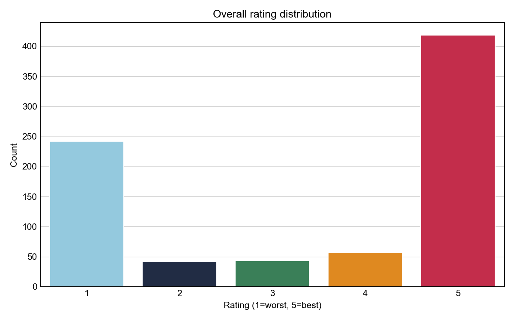
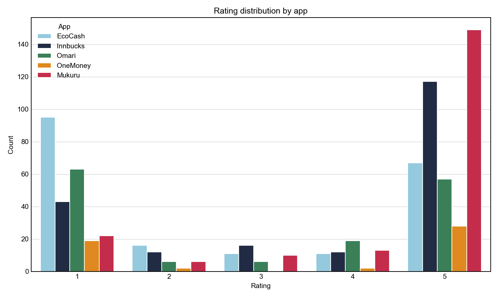
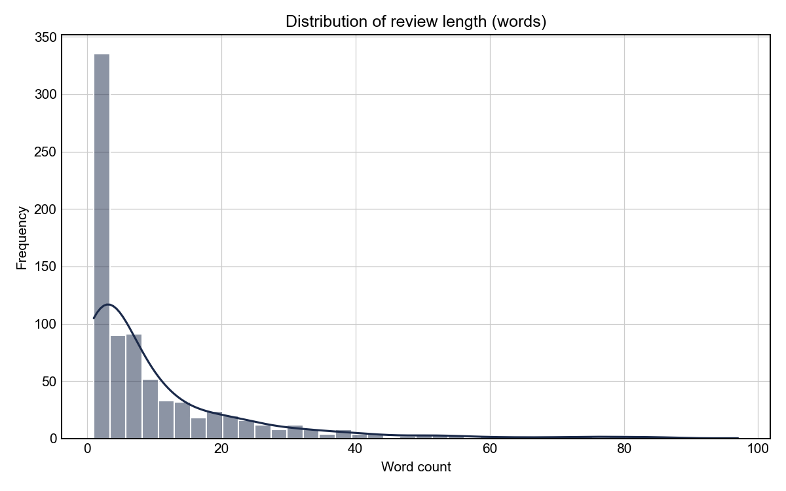
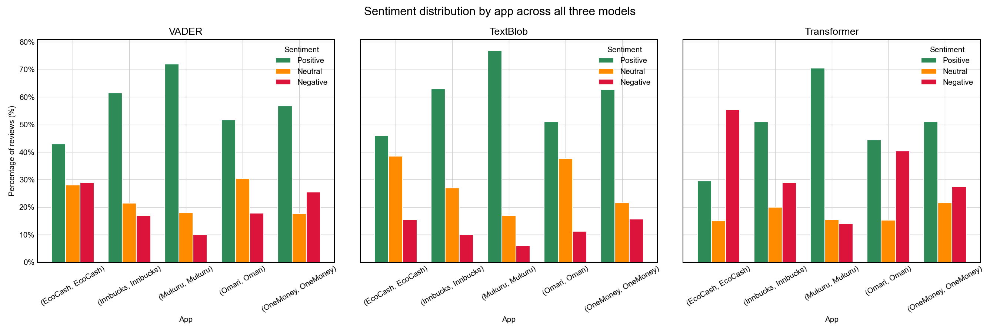
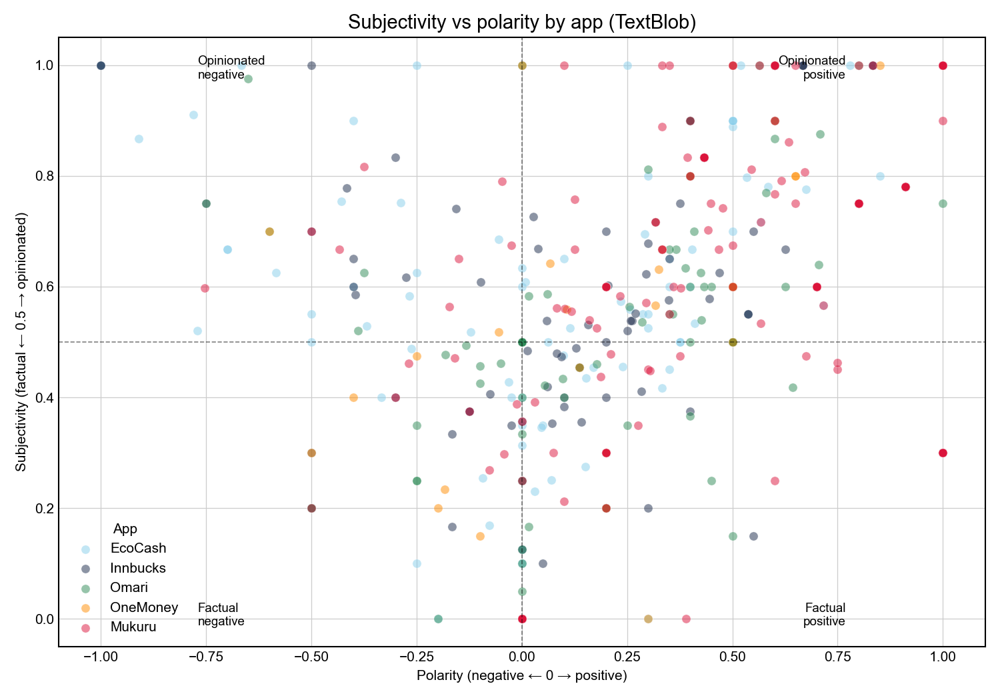
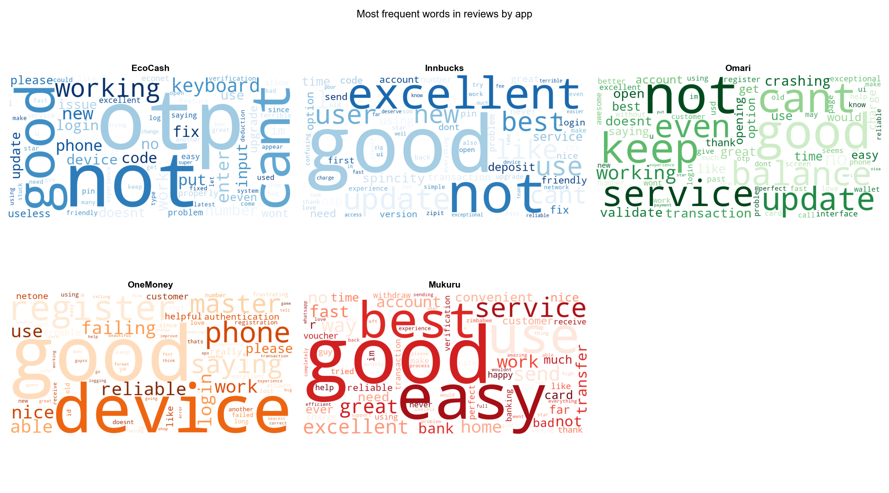
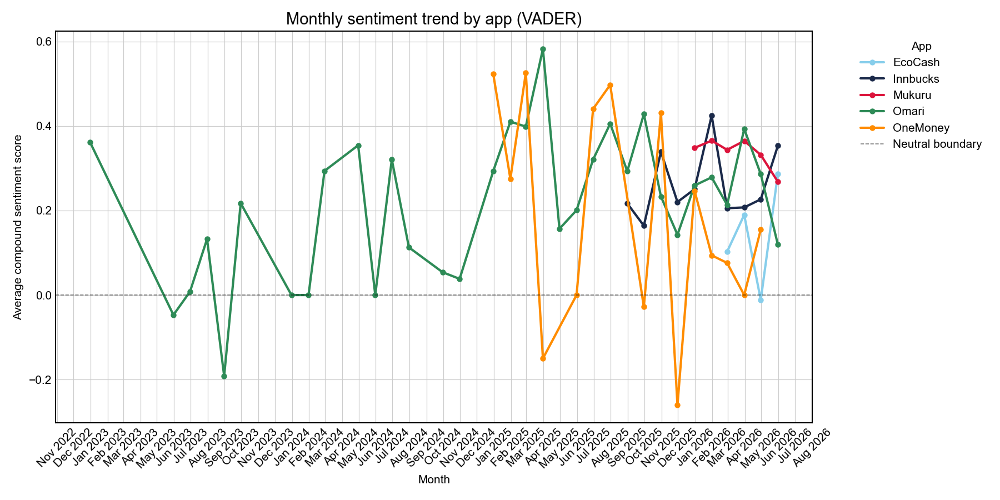
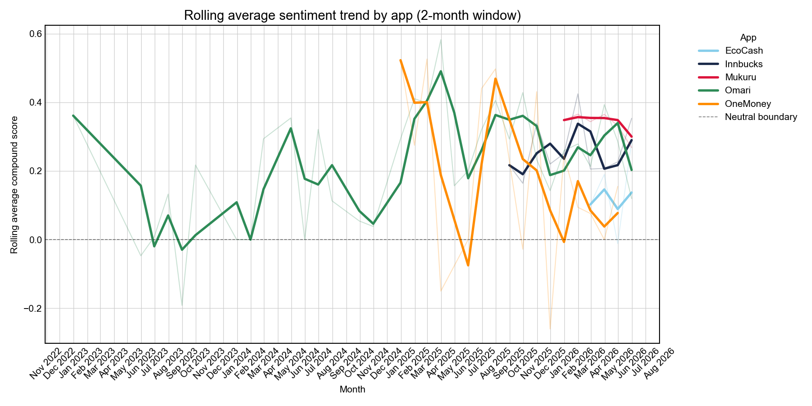
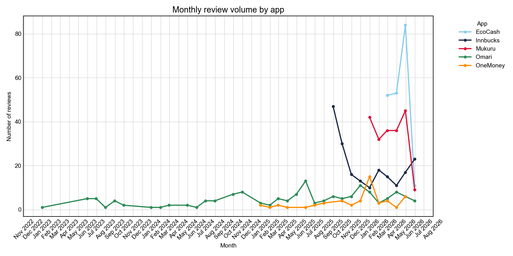
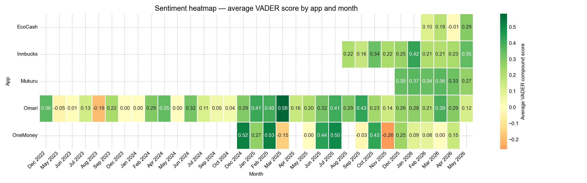

# Zimbabwe Mobile Money Sentiment Analysis
### A sector-level narrative intelligence project | Alistair C. Mazhambe

---

## Overview

This project applies natural language processing and sentiment analysis to Google Play Store reviews of five Zimbabwean mobile money platforms: **EcoCash, Innbucks, Mukuru, Omari, and OneMoney.**

The goal is to move beyond star ratings and extract structured sentiment intelligence from unstructured consumer text, tracking not just how users feel, but how that feeling shifts over time, what specific themes drive it, and where models agree or diverge in their interpretation.

The project was designed to mirror the kind of sector-level narrative monitoring that institutional intelligence systems perform in production — translating raw public discourse into actionable insight.

---

## Motivation

Data science has an underappreciated side. Beyond models and metrics lies a space where words carry the signal; where sentiment, narrative, and discourse tell stories that numbers alone cannot. Mobile money sits at the intersection of technology, trust, and everyday survival in Zimbabwe. When these platforms fail, people cannot pay bills, send money home, or access their own funds. Consumer reviews of these apps are therefore not mere product feedback, they are a real-time record of institutional trust.

This project is an attempt to read that record systematically.

---

## Apps Analysed

| App | Primary Use Case | Reviews Collected |
|-----|-----------------|-------------------|
| EcoCash | Domestic mobile money | 200 |
| Innbucks | Domestic mobile money | 200 |
| Mukuru | Cross-border remittances | 200 |
| Omari | Domestic mobile money | 151 |
| OneMoney | Domestic mobile money | 51 |

> **Note on Mukuru:** Mukuru is primarily a cross-border remittance service, serving a largely diaspora user base. Its reviewers reflect international transfer experiences — exchange rates, transfer speeds, agent availability — rather than the domestic retail payment friction that characterises the other four apps. This distinction should be considered when making cross-app comparisons.

**Total reviews: 802** | Collected via `google-play-scraper` | Date range: November 2022 – May 2026

---

## Project Structure

```
zimbabwe-mobile-money-sentiment/
│
├── data/
│   ├── raw_reviews.csv          ← 12 columns, exactly as scraped
│   ├── clean_reviews.csv        ← 5 columns, renamed
│   ├── eda_reviews.csv          ← adds review_length and proper dates
│   ├── processed_reviews.csv    ← adds sentiment_text and clean_tokens
│   ├── scored_reviews.csv       ← adds all sentiment model scores
│   └── temporal_summary.csv     ← monthly sentiment and volume summary
│
├── plots/
│   ├── rating_distribution.png
│   ├── rating_by_app.png
│   ├── review_length.png
│   ├── monthly_sentiment_trend.png
│   ├── rolling_sentiment_trend.png
│   ├── review_volume.png
│   ├── sentiment_distribution_by_app.png
│   ├── subjectivity_vs_polarity.png
│   ├── wordclouds_by_app.png
│   └── sentiment_heatmap.png
│
└── notebook.ipynb
```

---

## Pipeline

The project follows a six-stage pipeline:

### Stage 1 — Data Collection
Reviews scraped using `google-play-scraper`. Raw data saved immediately before any transformation. Country parameter set to `us` to maximise index coverage, Play Store reviews are not strictly country-locked.

### Stage 2 — Exploratory Data Analysis

Basic shape, missing values, data types, rating distributions, and review length statistics. The dataset exhibits a classic **J-curve rating distribution**, users predominantly review when strongly satisfied or strongly dissatisfied, with ratings 2, 3, and 4 collectively underrepresented. Review length has a median of 5 words, confirming that the dataset consists primarily of short, informal text.







### Stage 3 — NLP Preprocessing (Two-Track)

To preserve linguistic richness for sentiment modelling while enabling clean token analysis, preprocessing was split into two parallel tracks:

**Track 1 — Full preprocessing** (for word frequency analysis and word clouds)
- Lowercasing → noise removal → tokenisation → stopword removal → lemmatisation
- Negation words (`not`, `can't`, `never`, etc.) were deliberately retained in stopword removal to prevent polarity inversion

**Track 2 — Light cleaning** (for sentiment scoring)
- Lowercasing and URL removal only
- Punctuation, capitalisation patterns, exclamation marks, and negations preserved
- VADER and transformer models read this track, as they were trained on exactly this kind of expressive informal text

### Stage 4 — Sentiment Modelling (Three Layers)

Three independent models were applied to enable triangulation and cross-validation:

| Model | Type | Strength |
|-------|------|----------|
| VADER | Rule-based lexicon | Handles informal text, punctuation intensity, negations |
| TextBlob | Rule-based lexicon | Adds subjectivity scoring alongside polarity |
| `cardiffnlp/twitter-roberta-base-sentiment` | Transformer (HuggingFace) | Contextual understanding, trained on 58M tweets |

Model agreement was computed across all three classifiers:
- **All agree: 463 reviews (57.7%)**
- **Two agree: 304 reviews (37.9%)**
- **All differ: 35 reviews (4.4%)**







### Stage 5 — Temporal Analysis

Sentiment resampled to monthly frequency per app. Rolling 2-month averages computed to smooth noise. Review volume tracked alongside sentiment to contextualise findings, a sentiment shift backed by high review volume carries significantly more weight than one from sparse data.







### Stage 6 — Visualisation and Reporting

Ten publication-ready charts covering rating distributions, review length, model comparison, subjectivity-polarity scatter, word clouds, temporal trends, and a sentiment heatmap.



---

## Key Findings

### EcoCash — crisis and recovery
EcoCash recorded the only negative average sentiment month in the dataset, April 2026 (-0.01 VADER compound), coinciding with peak review volume. Word cloud and disagreement analysis independently identified a recurring **OTP authentication failure** as the dominant complaint theme: users were locked out of the app when a keyboard failed to appear during OTP entry. This issue surfaced across multiple review types including factual bug reports, which rule-based models systematically misclassified as neutral or positive — underscoring the value of the transformer layer.

Critically, EcoCash showed a **measurable recovery in May 2026**, recording both its highest monthly sentiment score (0.29) and its highest ever review volume (84 reviews). A high-volume positive sentiment event of this kind is a strong signal of a product-level improvement resonating at scale.

### Mukuru — sector-leading consistency
Mukuru maintained the narrowest sentiment range in the dataset (0.27–0.37 VADER compound) and the highest proportion of 5-star reviews. Word cloud analysis reflects this, dominant terms include *best*, *easy*, *great*, *excellent*, and *service*. As a remittance-focused platform, Mukuru's consistency likely reflects a more defined, singular use case compared to the broader feature surface of domestic mobile money apps.

### Innbucks — strong but oscillating
Innbucks performed well across all three sentiment models, with a high proportion of positive reviews and favourable word cloud themes. However, its monthly sentiment trajectory shows a persistent oscillation pattern; strong months followed immediately by weaker ones, suggesting responsive but inconsistent product iteration. An update-related theme was visible in word frequency analysis alongside references to *SpinCity*, a loyalty feature, warranting further investigation.

### Omari — chronic instability
Omari's four-year data window reveals the most sustained sentiment instability in the dataset. Despite recording the highest single-month VADER score (0.58, April 2025), Omari also dipped into negative territory multiple times. Word cloud analysis surfaced themes of crashing, balance issues, service failures, and update problems, consistent with a product attempting to expand its feature set faster than its stability can support.

### OneMoney — the deepest trough
OneMoney experienced the sector's most severe sentiment crisis, dropping to -0.26 in November 2025, the lowest score in the entire dataset. Three months returned no VADER scores due to data sparsity. Word cloud themes of *register*, *device*, *failing*, and *please* suggest persistent onboarding and authentication friction. A partial recovery followed but sentiment remained below 0.20 through early 2026.

---

## On Negative Reviews as Engagement

A high volume of negative reviews should not be interpreted as pure failure. For a market-dominant platform like EcoCash, negative reviews represent active users articulating specific grievances, a form of retained engagement more valuable than silent churn. A dissatisfied user who writes a review has not yet left.

The critical distinction lies in trajectory. Persistent negative sentiment signals an unaddressed systemic failure. Oscillating sentiment, as observed in Innbucks, may instead indicate a responsive but inconsistent product team: one that fixes issues but introduces new ones in the process. These are meaningfully different problems requiring different responses.

---

## Limitations

**Temporal sampling bias**
Reviews were capped at 200 per app sorted by most recent. Apps with high review velocity such as Mukuru returned 200 reviews spanning only recent months, while lower-engagement apps such as Omari span multiple years within the same sample. Direct temporal comparisons between apps should be interpreted cautiously. A more rigorous approach would apply date-bounded scraping across a fixed shared window for all apps.

**Rule-based model limitations**
VADER and TextBlob rely on explicit sentiment vocabulary and struggle with factual complaint language. A review stating *"cannot enter OTP, please fix"* contains no strongly negative words, both models classified it as neutral or positive despite clear user frustration. The transformer model handled these cases more accurately. In production, rule-based models should be treated as a first-pass signal rather than a definitive classifier.

**Negation handling**
Standard NLP preprocessing strips negation words, risking polarity inversion, *"not good"* becomes *"good"*. This project preserves negation words in Track 1 and uses raw text in Track 2 to mitigate this, but edge cases remain, particularly with contracted negations that survived inconsistently depending on punctuation handling.

**Token boundary collisions**
Where reviewers used punctuation without surrounding spaces (e.g. *"good app..easy"*), word joining occurred after punctuation removal, producing malformed tokens. This affects Track 1 only. Track 2 preserves the original text for sentiment scoring, minimising analytical impact.

**Colloquial and regional language**
Zimbabwean English contains colloquialisms and code-switching patterns not well represented in standard sentiment lexicons. Terms like *"juice"* (to activate a bundle) carry domain-specific meaning invisible to general-purpose models. A fine-tuned model on Zimbabwean consumer text would likely improve classification accuracy meaningfully.

---

## Further Investigation

- **Rating-sentiment correlation:** Compute alignment between model labels and reviewer star ratings as an indirect accuracy proxy, 1-star reviews should yield negative labels, 5-star reviews positive ones.
- **Date-bounded re-scraping:** Collect all reviews within a fixed shared window across all apps for rigorous temporal comparison.
- **Topic modelling:** Apply LDA or BERTopic to identify latent themes beyond keyword frequency, particularly useful for Innbucks' SpinCity references and Omari's feature-creep hypothesis.
- **Fine-tuning on Zimbabwean text:** A transformer fine-tuned on local consumer language would address colloquialism gaps identified in this analysis.

---

## Tech Stack

| Tool | Purpose |
|------|---------|
| `google-play-scraper` | Data collection |
| `pandas`, `numpy` | Data manipulation |
| `nltk` | Tokenisation, stopwords, lemmatisation |
| `vaderSentiment` | Rule-based sentiment scoring |
| `textblob` | Polarity and subjectivity scoring |
| `transformers`, `torch` | Transformer-based sentiment model |
| `matplotlib`, `seaborn` | Static visualisation |
| `wordcloud` | Word frequency visualisation |
| `jupyter` | Notebook environment |

---

## About

**Alistair C. Mazhambe** — Operations Research & Statistics Graduate, National University of Science and Technology (2025). This project was built as a portfolio piece demonstrating applied NLP and sentiment analysis in an African consumer context, with a deliberate focus on the kind of narrative intelligence infrastructure being developed for institutional use across the continent.

*"Not everything that matters can be measured. The most consequential signals, public trust, institutional reputation, social mood, live in language."*

---